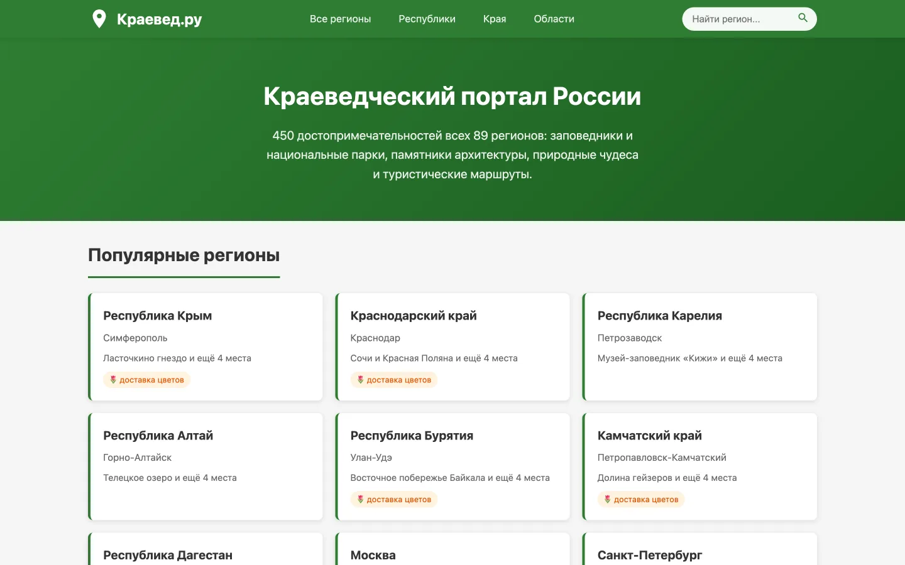

# kraeved.ru

A static local-history portal covering Russia: 89 federal subjects, 8 federal districts, 450 landmarks. 99 pages are built by a Python generator from JSON data, checked by a link linter and uploaded as they are — no server, no database, no bundler.

> Client work. The project has a partner side — regions the partner delivers flowers to get a section on the local flora and a delivery link; it is described [at the end](#partner-links).

<p align="center">
  
</p>

## How it is put together

```
data/*.json          regions, districts, content, the partner's city map
      ↓
generate.py          → 99 HTML pages + sitemap.xml + robots.txt + search-index.json
      ↓
check_links.py       links, duplicate SEO fields, sitemap agreement — before upload
```

| File | Lines | What it does |
|---|---|---|
| `generate.py` | 718 | page templates, structured data, sitemap, search index |
| `check_links.py` | 251 | release check: broken links, duplicate `title` / `description` / `H1` / `canonical` |
| `sync_partner.py` | 87 | reconciles cities and shops against the partner's sitemap |

## Updating the site

```bash
python3 sync_partner.py            # reconcile the partner's cities and shops (network)
python3 generate.py                # rebuild HTML, sitemap.xml, robots.txt
python3 check_links.py --external  # check links, duplicate SEO fields, sitemap
```

The whole directory goes to the server as it stands: HTML plus `css/`, `js/`, `data/`. `.htaccess` is already set up for clean URLs without `index.html`.

## Data (`data/`)

| File | Contents |
|---|---|
| `regions.json` | 89 subjects: name, grammatical cases, capital, type, district, delivery cities |
| `regions_content.json` | region content: description, landmarks (`name` / `short` / `full`), flora |
| `partner_cities.json` | city → slug and shop on the partner's site |
| `districts.json` | 8 federal districts: name, centre, slug, description |

Text is edited only in `data/`, templates only in `generate.py`. HTML is never touched by hand — the next generator run overwrites it.

## Social preview image

`images/og-cover.jpg` — 1200×630, 40 KB, referenced by absolute URL in `og:image` on every page.

The thing to know about VKontakte: **it does not accept SVG in `og:image`**, so the logo is rasterised in advance. The requirements the cover satisfies: raster format, absolute `https` URL, served without redirects, and explicit `og:image:width` / `og:image:height` — without the dimensions VK sometimes shows a small snippet instead of a large one. `link rel="image_src"` is set as well (VK reads it as a fallback), along with `twitter:card`.

To redraw the cover, if the logo or the caption changes:

```bash
npm i playwright && npx playwright install chromium   # once
node tools/make-og.js
```

The layout lives in `tools/og-template.html` — plain HTML, edited like a page. The `tools/` directory is build-only and does not need to be uploaded.

**After deploying to the domain** VK caches the snippet. If the image does not appear, or an old one is picked up, the cache is cleared by hand at vk.com/dev/pages.clearCache, field "page link". For Telegram, send `/start` to @WebpageBot.

## Speed

The pages are static and light (~6 KB gzipped), so optimisation comes down to keeping everything unnecessary off the critical path:

- **The search index loads lazily.** `regions.json` (27.6 KB) used to be downloaded on every page just for the search box. There is now `data/search-index.json` — 10.1 KB (2.1 KB gzipped) — requested only once the user hovers or clicks the search field. The file is generated automatically.
- **Analytics starts after paint** — on the first interaction (click, scroll, key) or after 2.5 s, whichever comes first. The Yandex Metrica script with session recording enabled is heavier than the rest of the site put together, and in `<head>` it delayed first paint. Its parameters sit in `window.__metrika`, the launch in `main.js`.
- **Navigations are preloaded.** Speculation Rules with `eagerness: moderate` are in `<head>`: Chrome and Edge prepare the page on hover, before the click. For other browsers `main.js` falls back to `<link rel="prefetch">` on hover, disabled under `saveData` and on 2G.
- **Caching and compression** in `.htaccess`: css/js/svg for 30 days, HTML for 30 minutes with revalidation, gzip plus brotli where the module is built.

Measured on a local server, region page: 3 requests and 45 KB against 4 requests and 70 KB before the changes. Walking five pages in a row, css and js come from cache and `load` drops from 98 ms on the first page to 7–13 ms on the rest. On an emulated mobile connection with 150 ms latency, `load` is around 515 ms.

If more speed is ever needed, the next step is turning off `webvisor` in `METRIKA_CONFIG` (top of the generator): session recording costs more than the entire rest of the page — but that is a question about what the analytics is for.

## What check_links.py verifies

- internal links resolve to files that exist;
- `sitemap.xml` matches the actual set of pages;
- `title`, `description`, `H1` and `canonical` are unique across all 99 pages — duplicates here mean pages getting merged in search results;
- no leftover placeholder text from the previous generator;
- partner links return 200 without a redirect (`--external`).

The check is part of the release rather than an optional extra: without it, it is easy to miss that a region fell back to template text or that a shop link went stale.

## Partner links

The partner site has **no city-level landing pages**: `/city/` returns a 302 to the home page and loses the link's weight. Only `/city/shop` works, so the generator substitutes a specific shop from `partner_cities.json`. The partner's transliteration is non-standard (`arxangelsk`, `soci`, `celiabinsk`), so slugs cannot be guessed — they can only be taken from the map.

`sync_partner.py` reads the partner's sitemap and reports a closed shop or a new city; with `--write` it substitutes the replacement automatically.

### Adding a region to delivery

1. Check the city exists on the partner's side: `python3 sync_partner.py`.
2. Add the city to `data/partner_cities.json` (Russian name → `slug` + `shop`).
3. Set `"hasFlowers": true` and `"flowersCities": ["City"]` on the region in `data/regions.json`.
4. `python3 generate.py && python3 check_links.py --external`.
